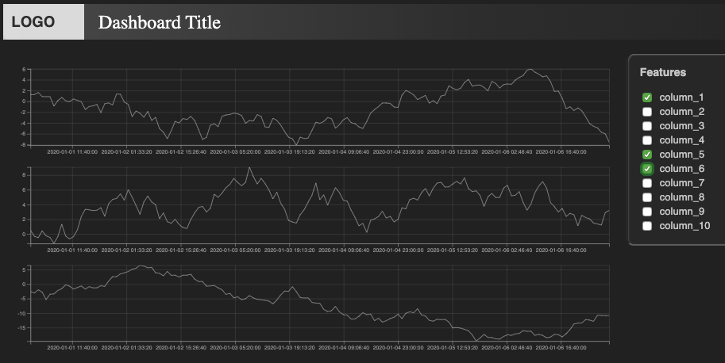
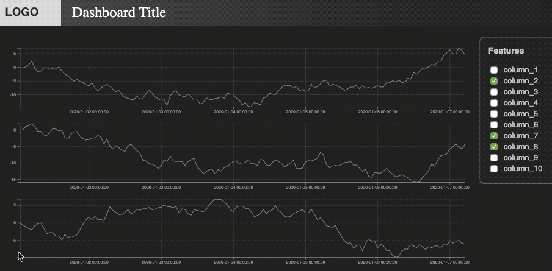

# D3 Time-series Dashboard

The purpose of this project is to provide an analysis dashboard ( <a href=https://d3js.org/>D3.js</a> ) that allows to conveniently visualize and manipulate time-series data. Loading data from columnar formats such as CSV is supported. 

**Usage scenarios**
- Anomaly detection
- Feature inspection/selection
- Data exploration (multiple time-series on a common x-axis)

<br>


<br>

<!-- []() -->
<br>


## Demo



---

## Table of contents

- [Features](#features)
- [Setup](#setup)
- [Browser support](#browser-support)
- [License](#license)

---

## Features

- Side-by-side comparison of multiple time-series (common x-axis)
- Feature panel with checkboxes to display/hide certain columns (time-series) on the dashboard
- Panel dimensions & labels auto-generated from the column headers in the CSV file
- Zoom in simultaneously in all active graphs (double click to reset zoom)
- Simultaneous highlighting of mouse-hovered data points in all active graphs
- Dashboard fully rescales when the the browser window is resized


---

## Setup

**Dependencies**

- <a href=https://jquery.com/>jQuery</a>
- <a href=https://d3js.org/>D3.js</a>

By default, the online-versions will be loaded when starting the dashboard.


### Local server

A local HTTP server is needed to load data from the disc into the dashboard using Javascript. Below are three possible methods to set this up:
- A simple way is to use <a href=https://code.visualstudio.com/>Visual Studio Code</a> and install the <a href=https://github.com/ritwickdey/vscode-live-server>Live Server</a> extension. (The "Go Live" option will show after adding the current folder to the workspace).
- Alternatively, you can install web server software such as <a href=https://httpd.apache.org/>Apache Server</a>, or <a href=https://www.nginx.com/resources/wiki/>Nginx</a>.
- As a third option, you can start a server programatically, e.g., using Python, Node.js, or any other language that provides this functionality.<br><br>
A simple example using Python:
<div style="padding-left: 40px">

```python
cd <path/to/dashboard_root_folder>
python -m http.server 

# Type the output URL into your browser, which will show the folder contents. 
# Then, select the file "dashboard_d3.html" to open the dashboard.
```
</div>

---


## Browser support

 &nbsp;
 &nbsp;

<br><br>

---

## FAQ

- **How can I load my data into the dashboard ?**<br>
    
    Assuming a running HTTP server (see description above): 

    1. Put your data file into the dashboard root folder.
    2. Open <i>dashboard.html</i> in a text editor and search for the line including <i>d3.csv("./test_data.csv").</i>
    3. Replace <i>test_data.csv</i> with the name of the (CSV) file you wish to load.


---

## License

- **[MIT license](http://opensource.org/licenses/mit-license.php)**